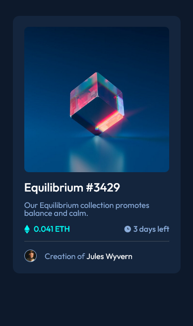
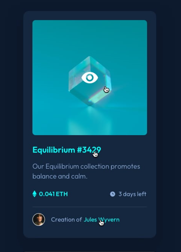
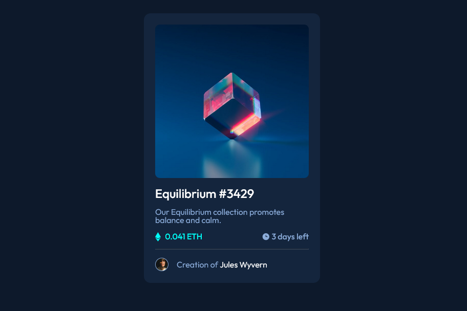

# Frontend Mentor - NFT preview card component solution

This is a solution to the [NFT preview card component challenge on Frontend Mentor](https://www.frontendmentor.io/challenges/nft-preview-card-component-SbdUL_w0U). Frontend Mentor challenges help you improve your coding skills by building realistic projects. 

## Table of contents

- [Frontend Mentor - NFT preview card component solution](#frontend-mentor---nft-preview-card-component-solution)
  - [Table of contents](#table-of-contents)
  - [Overview](#overview)
    - [The challenge](#the-challenge)
      - [Screenshots](#screenshots)
    - [Links](#links)
  - [My process](#my-process)
    - [Built with](#built-with)
    - [What I learned](#what-i-learned)
    - [Useful resources](#useful-resources)
  - [Author](#author)

## Overview

### The challenge

Users should be able to:

- View the optimal layout depending on their device's screen size
- See hover states for interactive elements

#### Screenshots
- Mobile

  
  

Desktop

### Links

- [Github](https://github.com/LevyMatias/NFT_preview_card_component)
- [Live Site](https://levymatias.github.io/NFT_preview_card_component/)

## My process

### Built with

- Semantic HTML5 markup
- Reset CSS file
- CSS custom properties
- Flexbox
- Mobile-first workflow
- BEM Methodology

### What I learned

I learned how to use the css [clamp](https://developer.mozilla.org/en-US/docs/Web/CSS/clamp) function and learned more about responsiveness.

### Useful resources

- [W3Schools](https://www.w3schools.com/css/)
- [CSS Tricks](https://css-tricks.com/) 
  
## Author

- [Portfolio](https://levymatias.github.io/Portfolio/)
- [Frontend Mentor](https://www.frontendmentor.io/profile/LevyMatias)
- [Linkedin](https://www.linkedin.com/in/levy-matias/)
